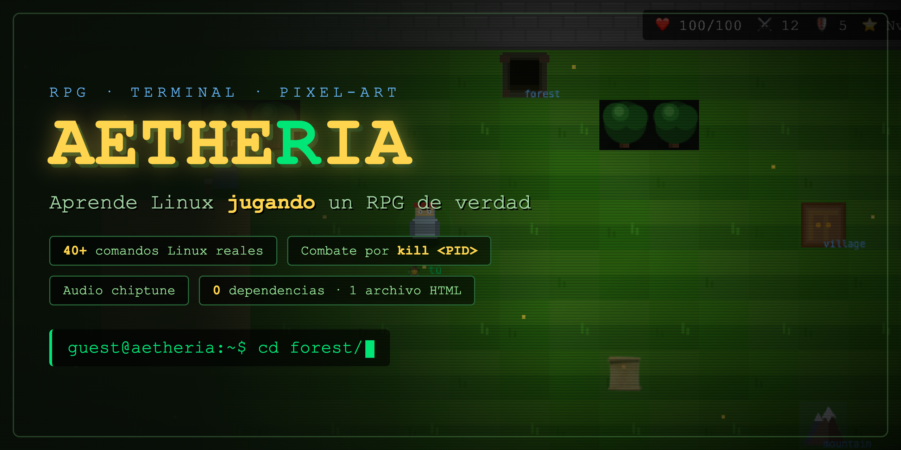
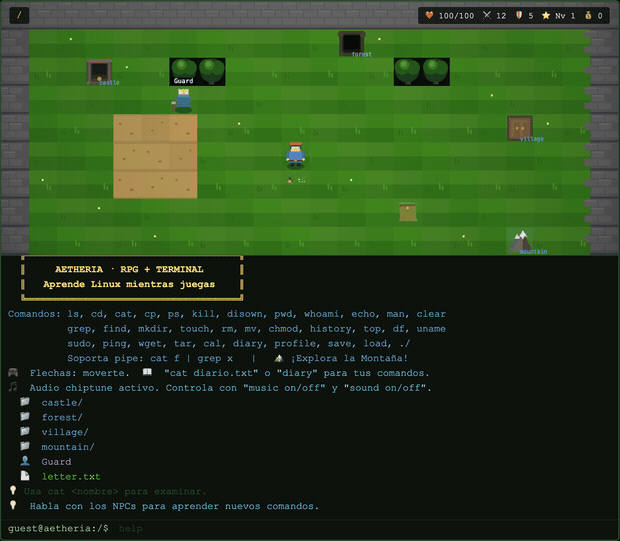
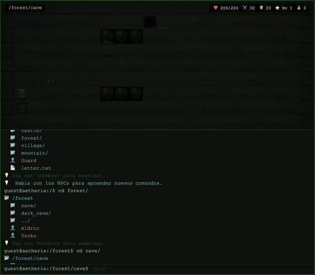

# Aetheria — RPG + Linux Terminal



Aprende Linux mientras juegas. RPG híbrido con mapa visual en pixel-art, terminal interactiva, audio chiptune y **comandos reales de Linux**.

## Requisitos

Navegador web moderno (Chrome, Firefox, Safari, Edge). **Cero dependencias.**

## Instalación

```bash
git clone <url-del-repo>
cd game
open index.html
```

No requiere servidor, npm, ni instalación de ningún tipo. Funciona incluso sin conexión a internet.

## Gameplay



Explora el mundo con las flechas, habla con NPCs y resuelve la misión usando comandos reales de Linux.

## Cómo jugar

| Comando | Descripción |
|---------|-------------|
| `ls` / `ls -la ~/` | Lista la sala / muestra tu inventario |
| `cd <puerta>` | Cambia de sala |
| `cat <nombre>` | Examina objetos o habla con NPCs |
| `cp <item> ~/` | Toma/compra un item |
| `ps` | Muestra enemigos como procesos con PID |
| `kill <PID>` | Ataca a un enemigo por su PID |
| `disown` | Huye del combate |
| `./<archivo>` | Ejecuta un archivo (skills, items, scripts) |
| `chmod +x <archivo>` | Da permisos de ejecución |
| `grep` `find` `mkdir` `touch` `rm` `mv` | Manipulación de archivos |
| `echo` `history` `top` `df` `uname` `cal` | Utilidades del sistema |
| `sudo` `ping` `wget` `tar` | Comandos avanzados |
| Pipes y redirección | `cat f \| grep x`, `echo hola > f.txt` |
| `whoami` / `cat ~/profile` | Identidad / ficha de personaje |
| `diary` / `cat diario.txt` | Diario de comandos aprendidos |
| `music on/off` / `sound on/off` | Control de audio |
| `save` / `load` | Guardar / cargar partida |
| `help` / `man <cmd>` | Ayuda |

**Flechas:** moverte. **ESPACIO en combate:** atacar.

## Combate



El combate es por turnos: usa `ps` para ver los enemigos como procesos, y `kill <PID>` para atacarlos. Hay números de daño flotantes, partículas y efectos de pantalla.

## Lo que ofrece

- **RPG con mapa visual pixel-art** — 15 salas interconectadas: castillo, bosque, cueva oscura, mazmorra profunda, aldea, posada, tienda y la Montaña del Kernel con su cima.
- **Linux real** — Más de 40 comandos de Linux de verdad: `cp`, `kill`, `ps`, `disown`, `chmod`, `grep`, `find`, `mkdir`, `touch`, `rm`, `mv`, `echo`, `top`, `df`, `uname`, `sudo`, `ping`, `wget`, `tar`, `cal`, pipes (`|`) y redirección (`>`, `>>`).
- **Combate por turnos** — Enemigos con ATK/DEF/HP, habilidades especiales, jefe final con ataque demoledor cada 3 turnos.
- **Sistema de inventario y tienda** — Compra armas, armaduras y libros de habilidades con `cp <item> ~/`, equípalos con `./<item>`.
- **Habilidades** — Aprende Power Strike (doble daño) y Heal (curación).
- **Quiz de Linux** — Oroku te reta con preguntas sobre Linux a cambio de recompensas.
- **Retos de NPCs** — Greta (archivista), Otto (el ordenado) y Nettie (operadora de red) te ponen desafíos de comandos reales y te recompensan con oro.
- **Puzzle de la montaña** — Kerwin, el montañista, te guía: usa `chmod +x ascend.sh` y `./ascend.sh` para desbloquear la cima.
- **Audio chiptune procedural** — 7 pistas musicales sintetizadas en tiempo real y efectos de sonido. Sin archivos de audio.
- **Gráficos animados** — Pasto, agua y árboles con animación, sprites con bobbing, partículas, sacudida de pantalla, transiciones y viñeta ambiental.
- **Sistema de niveles** — Gana XP en combate, sube de nivel y mejora HP/ATK/DEF.
- **Diario de comandos** — Se llena automáticamente con los comandos que aprendes.
- **Jefe final** — Goblin Chief en la mazmorra profunda. Al vencerlo, los NPCs actualizan sus diálogos y el Rey aparece en la raíz `/`.
- **Persistencia** — Guarda tu partida con `save` y cárgala con `load` (en tu navegador, vía `localStorage`).

## Privacidad

100% offline y privado: **no recopila ningún dato del usuario, no usa cookies, no hace conexiones de red y no transmite nada a terceros.** Lo único que se guarda es tu partida, y queda en tu propio navegador (`localStorage`).

## Material promocional

Imágenes y videos del juego en la carpeta [`promotion/`](promotion/) (banner, GIFs y clips MP4), generados a partir del juego real.

## Licencia

GPL v3. Todo el contenido (código, gráficos y música) es original.
