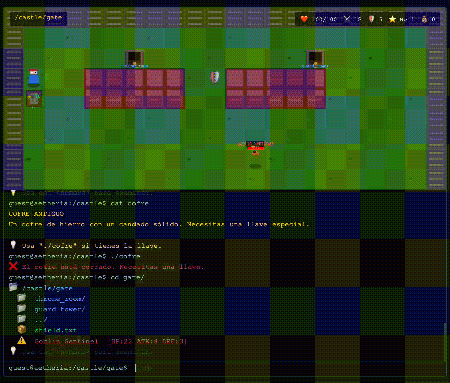
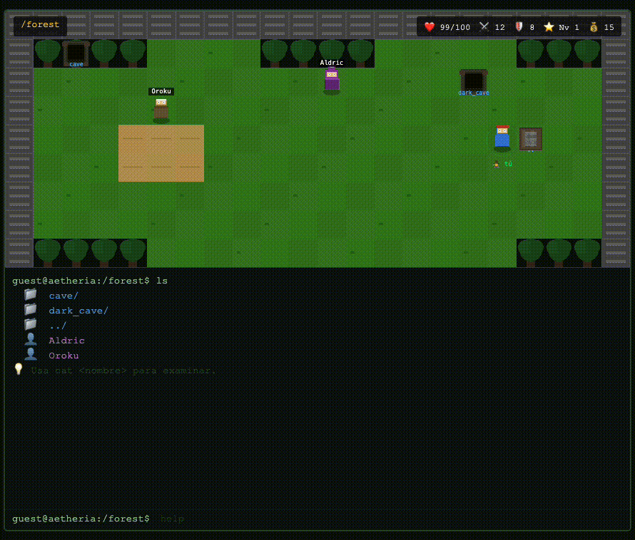
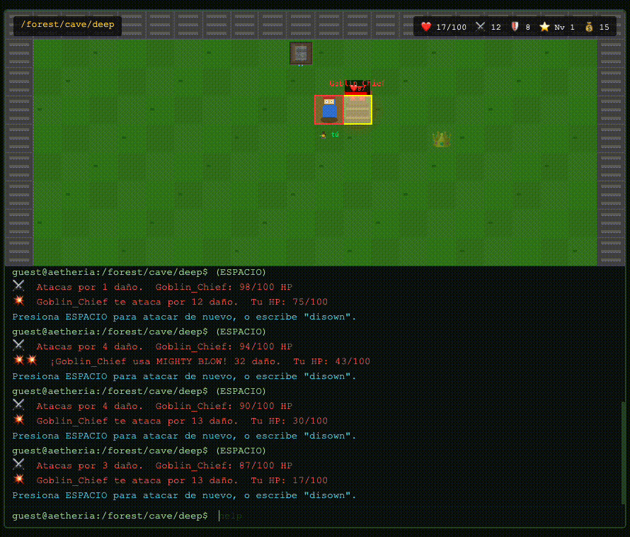

# Aetheria — RPG + Linux Terminal


Aprende Linux mientras juegas. RPG híbrido con mapa visual, terminal interactiva y comandos reales de Linux.

## Requisitos

Navegador web moderno (Chrome, Firefox, Safari, Edge). **Cero dependencias.**

## Instalación

```bash
git clone <url-del-repo>
cd game
open index.html
```

No requiere servidor, npm, ni instalación de ningún tipo.

## Cómo jugar

| Comando | Descripción |
|---------|-------------|
| `ls` | Lista elementos de la sala actual |
| `cd <puerta>` | Cambia de sala |
| `cat <nombre>` | Examina objetos o habla con NPCs |
| `cp <item> ~/` | Toma un item del suelo |
| `ls -la ~/` | Muestra tu inventario |
| `ps` | Muestra enemigos como procesos con PID |
| `kill <PID>` | Ataca a un enemigo por su PID |
| `disown` | Huye del combate |
| `./<archivo>` | Ejecuta un archivo (skills, items, etc.) |
| `whoami` | Muestra quién eres |
| `cat ~/profile` | Ficha de personaje |
| `diary` / `cat diario.txt` | Diario de comandos |
| `save` / `load` | Guardar / cargar partida |
| `help` / `man <cmd>` | Ayuda |

**Flechas:** moverte. **ESPACIO en combate:** atacar.

## Lo que ofrece



- **RPG con mapa visual** — 13 salas interconectadas: castillo, bosque, cueva oscura, aldea, mazmorra profunda, tienda, posada.
- **Combate por turnos** — Enemigos con ATK/DEF/HP, habilidades especiales, jefe final con ataque Mighty Blow cada 3 turnos.
- **Linux real** — Todos los comandos son Linux de verdad: `cp`, `kill`, `ps`, `disown`, `ls -la ~/`, `./archivo`, `cd`, `cat`, `whoami`, `pwd`, `echo`, `man`, `clear`, `save`/`load`.
- **Sistema de inventario** — Compra items en la tienda con `cp <item> ~/`, equípalos con `./<item>`.
- **Habilidades** — Aprende Power Strike (doble daño) y Heal (curación) comprando libros.



- **Quiz de Linux** — Oroku te reta con 25 preguntas sobre Linux. Responde bien y obtén recompensas.
- **NPCs con diálogo** — 9 NPCs con historias, misiones, y diálogos que cambian al vencer al jefe.
- **Sistema de niveles** — Gana XP en combate, sube de nivel, mejora HP/ATK/DEF.
- **Diario de comandos** — Se llena automáticamente con los comandos que aprendés.



- **Jefe final** — Goblin Chief en la mazmorra profunda. Al vencerlo, los NPCs actualizan sus diálogos y el Rey aparece en la raíz `/`.
- **Persistencia** — Guardá tu partida con `save` y cargala con `load`.
- **Patrullaje** — NPCs y enemigos se mueven por el mapa.
- **Sin dependencias** — Un solo `index.html`, cero frameworks, cero telemetría, 100% local.
